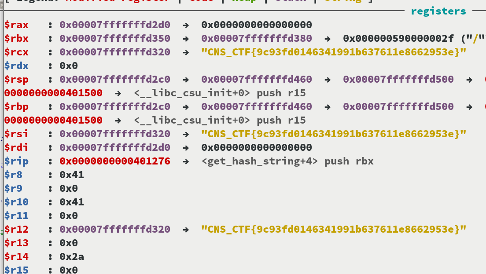

1. Open the binary in IDA, and identify the __call_me function, it won't be in the text section in order to decoy.
2. Now, go to the main function assembly, and you should see that there is a call to `validate_hash` function. Click on that line and go to `Edit > Patching > Assemble` and change from `call validate_hash` to `call __call_me`. This will allow to do the real validation of the flag. Now click `Apply patching` and it should be changed.
3. Open the patched binary with `gdb ./call_me` and set a breakpoint on `get_hash_string`. This will allow you to see the flag passed as an argument to this function.
4. Run and enter any input, you should hit the breakpoint. Type `info reg` to see the registers. Arguments are passed in registers rdi, rsi, rdx, etc. The flag is passed as the second argument, so you can display it using `x/s $rsi`

